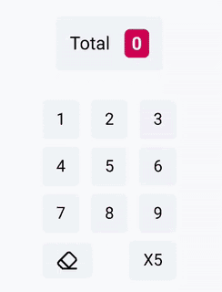

<div align="center">

# Swash

<p>
Swash is a React framework for <strong>drag and drop interactions</strong>.<br>
It provides utilities for passing data between components using drag and drop.
</p>



</div>

---

**DISCLAIMER**: This is very work in progress. The API is not stable and may
change at any time.

---

## How does this work?

### Main interactions

Swash has two main building blocks: the `Draggable` and `DragReceiver`
components.

Swash provides a `Draggable` component that wraps the component you want to make
draggable. Swash also provides a `DragReceiver` component that receives Swash
drag events.

Each draggable provides a `DraggableContext` to its children, which can be used
to set a payload that will be passed to the `DragReceiver` whenever the
Draggable interacts with it.

A `DragReceiver` can receive callbacks for properties such as
`onSwashDragEnter`. These callbacks will receive payloads from the draggable
that is currently interacting with the `DragReceiver`.

### Replying to draggables

The callbacks passed to `DragReceiver` can also reply to the draggable using the
event's `reply` method. This method can be used to send a payload to the
draggable, which may handle it if the `onReply` property is provided.

### Creating custom payloads

Swash tries to be type-safe. To add a custom payload, you can augment the
`PayloadTypeMap` interface like this:

```ts
declare module "swash" {
  interface PayloadTypeMap {
    person: { name: string; age: number };
  }
}
```

The code above will create a new payload type `"person"` that has the shape
`{ name: string; age: number }`.

### Displaying ghosts

Whenever a draggable is being dragged, it is removed from the layout it was in.
This can be a problem if you want to preserve the space it was occupying, or if
you want to make a smooth layout transition.

For such cases, `Draggable` has a `ghost` property so you can specify a React
Node to be rendered in the `Draggable`'s original location while it is being
dragged.

Ghost nodes can use the `GhostContext`, which provides the ghost node with the
draggable's last dimensions before it was removed from the layout.

## Documentation

Documentation with proper examples is still not available, but everything
exported in the module has JSDoc comments.

Please be patient, I'll make examples as soon as I can.
